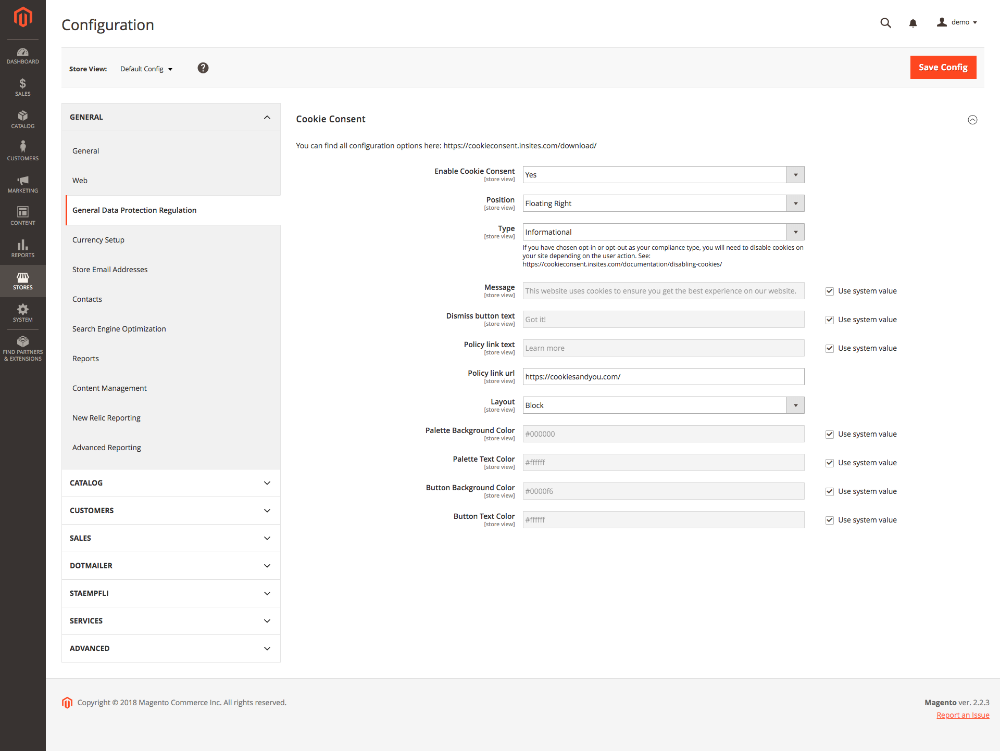

# Cookie Consent  
  
This configuration is a wrapper for **[Cookie Consent by Insites](https://cookieconsent.insites.com/)**, it allows you to configure the cookie notice based on their options. See: https://cookieconsent.insites.com/download/

  
  
  

> ## Compliance     
> ### 1. Informational     
> **You tell your users that you use cookies, and that by continuing to use your website they accept them.**      This is the approach used by
> most websites, and appears to be sufficient in Switzerland. Other
> countries have stricter rules and may warrant one of the stricter
> solutions.      This is also the easiest approach for shop owners to
> implement. It provides your users with no direct control over cookies,
> other than through their own browser settings.     
> ### 2. Opt-out     
> **You tell your users that you use cookies, and give them one button to disable cookies, and another to dismiss the message.**      (The
> dismiss button is generally more prominent). If a user does not choose
> to disable cookies, they will continue to work as normal.  
>       This approach gives users the ability to opt out of cookies if they wish. It is more involved to implement, and will require that you
> modify parts of your site that use cookies to disable them when so
> instructed. [Learn
> more](https://cookieconsent.insites.com/documentation/disabling-cookies/)
> 
> ### 3. Opt-in     
> **You tell your users that you wish to use cookies, and give them one button to enable cookies, and another to refuse them.**      (The
> enable button is generally more prominent). No cookies are used unless
> the user expressly chooses to enable them.      This is the strictest
> approach, and virtually guarantees compliance under any circumstances.
> Like option #2, it requires you modify parts of your site that use
> cookies to disable them when so instructed. [Learn
> more](https://cookieconsent.insites.com/documentation/disabling-cookies/).
> 
> ### Which should you choose?      The vast majority of websites at the time of writing – including big names like Google and Facebook –
> choose some variation of the “Information” approach, i.e. they tell
> users they use cookies but continue to use them. Of course, in their
> case, their websites would be unusable without cookies.      We cannot
> guarantee an informational approach will be sufficient for your
> website, but unless you have special cause to believe otherwise, it is
> extremely likely. If in doubt, seek legal advice from a professional.

  
*Source: https://cookieconsent.insites.com/documentation/compliance/*